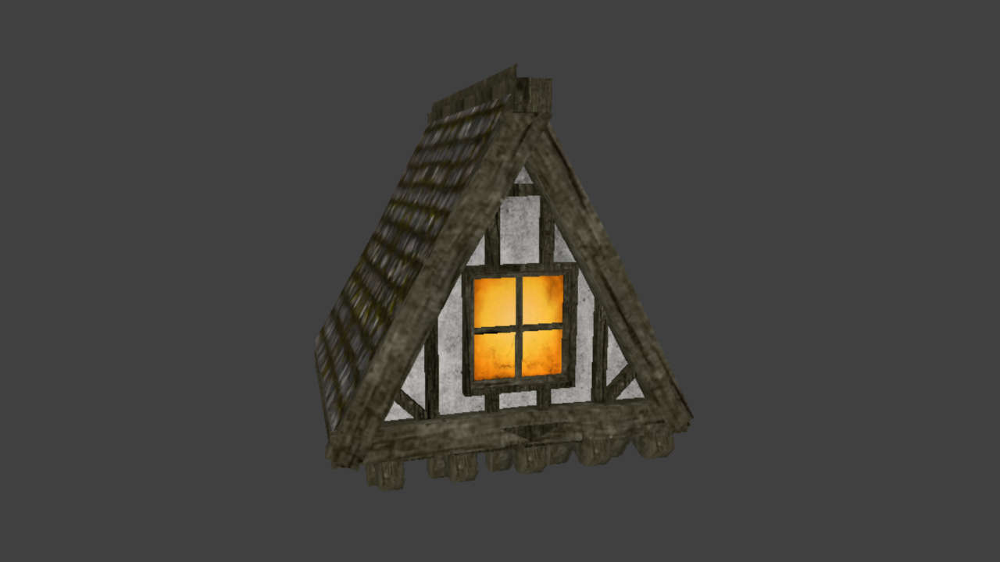

# Roof 128 Openable Window

## Details
- a rough copy of `models/darkmod/architecture/modules/exteriors/ext_timber01/ext_timber01_roof128_window.lwo` with an openable window
- suitable for entry point into an attic
- made with brushes and includes visportal; is completely sealed

## Preview image

